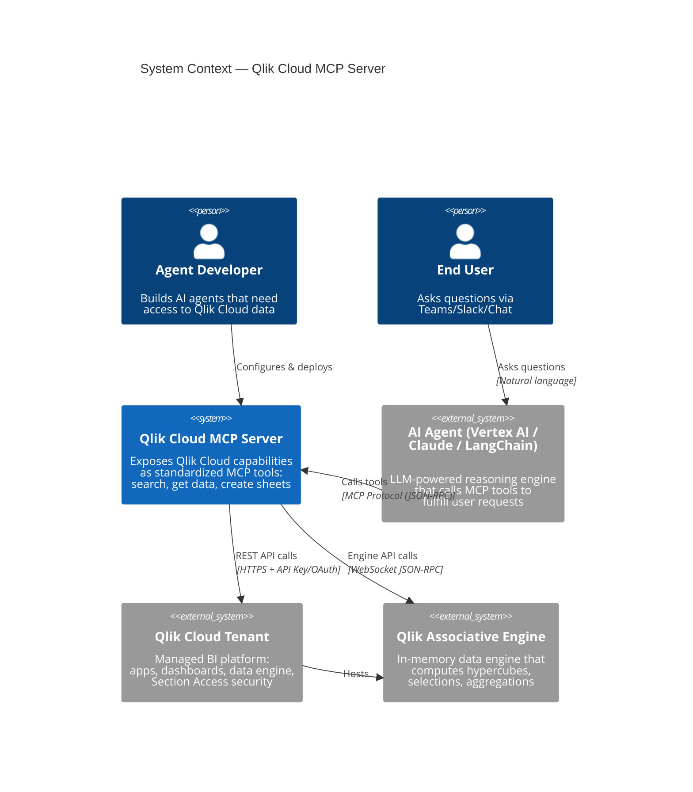

# C1: System Context Diagram

The MCP Server as the bridge between AI agents and Qlik Cloud.

## Narrative

The **Qlik Cloud MCP Server** is a protocol translation layer. AI agents speak **MCP** (a standardized tool-calling protocol), and the server translates those calls into **Qlik Cloud REST API** and **Engine API** operations.

Key interactions:

| From | To | Protocol | Purpose |
|------|----|----------|---------|
| AI Agent | MCP Server | MCP (JSON-RPC over stdio/SSE) | Tool discovery and invocation |
| MCP Server | Qlik Cloud REST | HTTPS | App catalog, search, metadata |
| MCP Server | Qlik Engine | WebSocket JSON-RPC | Hypercube data, sheet operations |

### Security Model

The MCP server authenticates to Qlik Cloud using a **service account API key** (or OAuth2 M2M credentials). All data access is governed by Qlik's **Section Access** rules — if the service account cannot see certain data, the tool returns an empty result. The MCP server **never bypasses** Qlik security.
