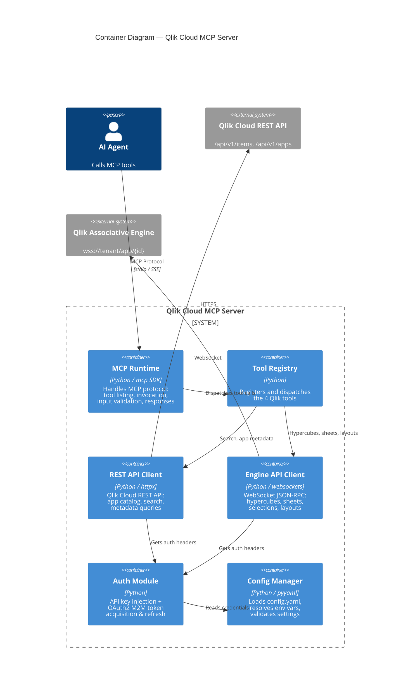

# C2: Container Diagram

Runtime containers that make up the MCP Server.



## Container Responsibilities

### MCP Runtime
- Implements the Model Context Protocol server using the official `mcp` SDK
- Handles tool listing (`tools/list`), tool invocation (`tools/call`), and error responses
- Supports stdio transport (for local agents like Claude Code) and SSE (for remote agents)
- Validates tool inputs against JSON Schema before dispatching

### Tool Registry
- Registers the four Qlik tools with their schemas and handlers
- Routes tool calls to the appropriate handler function
- Manages tool enable/disable via configuration

### REST API Client
- Async HTTP client (httpx) for Qlik Cloud REST API
- App catalog queries (`/api/v1/items`)
- App metadata (`/api/v1/apps/{id}`)
- Space listing and search
- Handles pagination, rate limiting, and retries

### Engine API Client
- WebSocket client for the Qlik Associative Engine JSON-RPC protocol
- Opens ephemeral connections per tool call (stateless)
- Implements the "handle" system: Global → Doc → GenericObject
- Methods: `GetLayout`, `CreateSessionObject` (hypercubes), `CreateSheet`
- Properly closes connections after each operation

### Auth Module
- **API Key mode**: Injects `Authorization: Bearer {key}` header
- **OAuth2 M2M mode**: Acquires access token via client credentials grant, caches and refreshes automatically
- Provides auth headers for both REST (HTTP) and Engine (WebSocket) clients

### Config Manager
- Loads `config.yaml` with `${ENV_VAR}` interpolation
- Validates required fields (tenant URL, credentials)
- Provides typed access to tool-specific settings (row limits, enabled tools)

## Transport Modes

```
┌─────────────────────────────┐      ┌──────────────────────────────┐
│  STDIO Transport (Default)  │      │  SSE Transport (Remote)      │
│                             │      │                              │
│  Claude Code ←→ stdin/out   │      │  Agent ←→ HTTP SSE endpoint  │
│  Local process, no network  │      │  Network, port 8080          │
│  Ideal for dev & testing    │      │  Ideal for production        │
└─────────────────────────────┘      └──────────────────────────────┘
```
