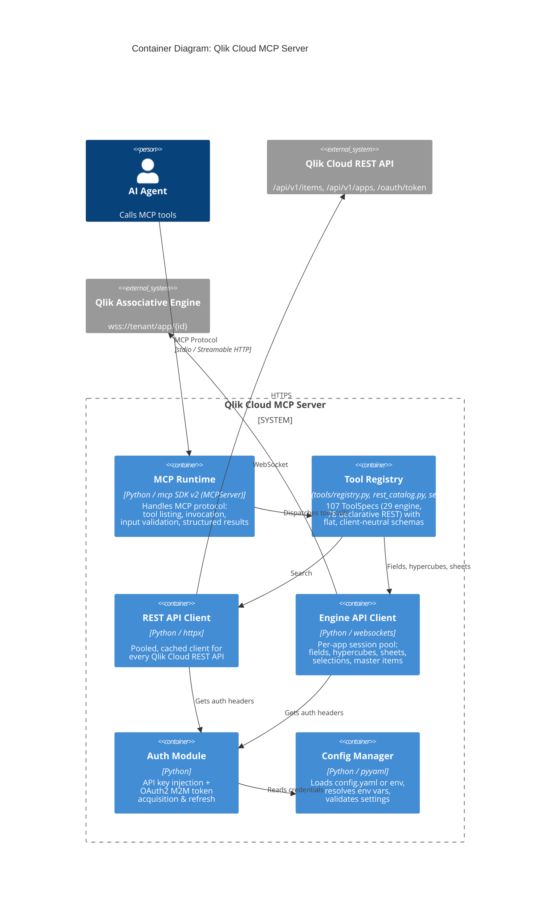

# C2: Container Diagram

Runtime containers that make up the MCP Server.



## Container Responsibilities

### MCP Runtime
- Implements the Model Context Protocol server using the official `mcp` SDK v2 `MCPServer`
- Handles tool listing (`tools/list`), tool invocation (`tools/call`), and error responses
- Supports stdio transport (for local agents like Claude Code) and Streamable HTTP (for remote agents); legacy SSE is still available with a deprecation warning
- Validates tool inputs against the generated JSON Schema before dispatching
- Emits every tool result as both text and structured content

### Tool Registry
- `tools/registry.py` orders 29 engine-backed `ToolSpec`s as a workflow (discover, model, dashboards, master items, bookmarks, selections, compute, build) followed by 78 REST-backed tools in 11 groups (automations, glossary, datasets, data products, lineage, knowledge, pipelines, alerts, ml, reloads, spaces, answers)
- REST tools are declared as data in `tools/rest_catalog.py` (`RestTool`: method, path, parameters, result shaper); one executor in `tools/rest_tools.py` runs them all
- `server.py` generates each tool's signature from its Pydantic input model, then simplifies the JSON Schema (no `$ref`, `$defs`, `anyOf`, `title`) so Claude, Gemini, and OpenAI clients all accept it
- Annotates tools as read-only, session-state (selections), write, or destructive (delete); `tools.profile`, `tools.disabled_groups`, `tools.disabled_tools`, `tools.allow_writes`, and `tools.allow_sheet_creation` decide what is registered
- Converts every failure into a JSON error payload; unexpected exceptions are logged in full but reported to the agent generically

### REST API Client
- Async HTTP client (httpx) for the Qlik Cloud REST API
- Catalog search (`GET /api/v1/items`, page size capped at 100)
- App metadata (`/api/v1/apps/{id}`), data model metadata (`/api/v1/apps/{id}/data/metadata`), and space listing
- Retries timeouts, honors `Retry-After` on 429 (capped at 60 seconds), and maps transport failures to a safe error
- Generic `call()` for the declarative tools, with a TTL cache (`qlik.cache_ttl_seconds`) for read-only metadata and text downloads for logs and markdown exports

### Engine API Client
- WebSocket client for the Qlik Associative Engine JSON-RPC protocol
- Keeps one WebSocket per app open between calls (`qlik.reuse_sessions`), serializing calls per app, expiring idle sessions, and evicting broken sockets; destroys temporary session objects after each call
- Applies per-call `filters` in a temporary alternate state so they never leak into the session; explicit selection tools act on the session's default state
- Implements the "handle" system: Global (-1) to Doc via `OpenDoc`, then GenericObject handles
- Methods used: `OpenDoc`, `GetAppLayout`, `GetScript`, `GetObjects`, `GetObject`, `GetLayout`, `GetProperties`, `CreateSessionObject` (field list, list object, master item lists, bookmark list, selection object, hypercube), `DestroySessionObject`, `AddAlternateState`, `RemoveAlternateState`, `SearchListObjectFor`, `SearchResults`, `GetHyperCubeData`, `GetListObjectData`, `GetField`, `SelectValues`, `Select`, `Clear`, `ClearAll`, `ApplyBookmark`, `CreateBookmark`, `DestroyBookmark`, `CreateDimension`, `GetDimension`, `DestroyDimension`, `CreateMeasure`, `GetMeasure`, `DestroyMeasure`, `CreateObject`, `CreateChild`, `SetProperties`, `DoSave`
- Unwraps raw results (`qLayout`, `qDataPages`, `qResult`, `qList`, `qProp`), which the JSON-RPC engine wraps by parameter name
- Skips engine notifications while waiting for a response and enforces per-message and per-request deadlines

### Auth Module
- **API Key mode**: injects `Authorization: Bearer {key}`
- **OAuth2 M2M mode**: posts a JSON client-credentials request to `/oauth/token`, caches the token, and refreshes before expiry
- Refuses token URLs that are not on the configured tenant host
- Provides auth headers for both REST (HTTP) and Engine (WebSocket) clients

### Config Manager
- Loads `config.yaml` with `${ENV_VAR}` interpolation, or builds config from environment variables alone
- Validates the tenant URL is a bare https origin, credentials are present, the transport is known, and the port is an integer
- Accepts legacy `sse_host` / `sse_port` keys and maps them to `http_host` / `http_port`

## Transport Modes

```
+-----------------------------+      +------------------------------+
|  STDIO Transport (Default)  |      |  Streamable HTTP (Remote)    |
|                             |      |                              |
|  Claude Code <-> stdin/out  |      |  Agent <-> HTTP /mcp         |
|  Local process, no network  |      |  Network, port 8080          |
|  Ideal for dev & testing    |      |  Behind an auth proxy        |
+-----------------------------+      +------------------------------+
```

When the HTTP transport is bound to a loopback address the server enables the SDK's DNS-rebinding protection (only localhost Host headers and origins are accepted). `server.http_bearer_token` adds a constant-time bearer check on every MCP request (with `/healthz` left open for load balancers), and `server.http_stateless` selects the stateless Streamable HTTP mode that Gemini Enterprise and load-balanced deployments prefer.
