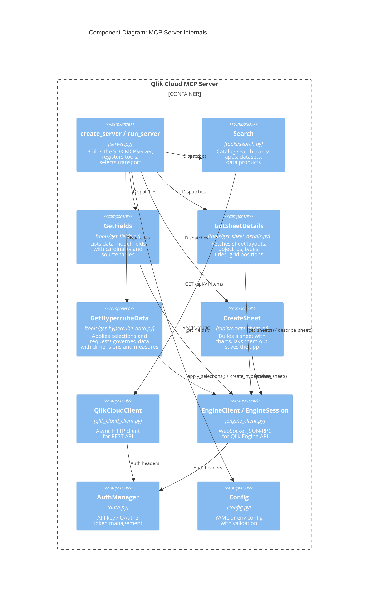
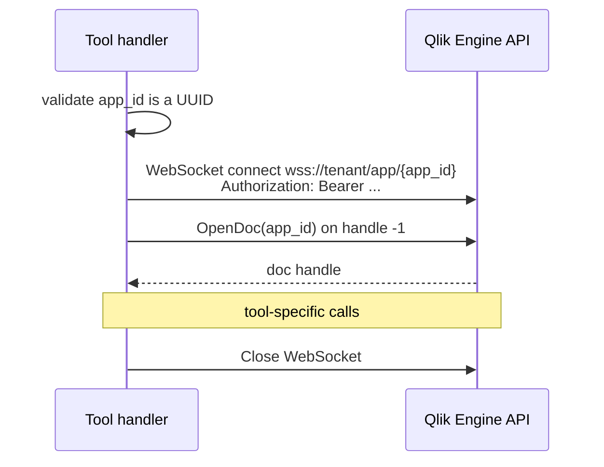
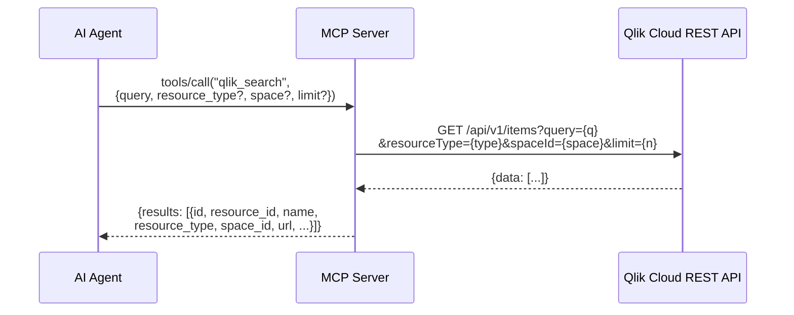
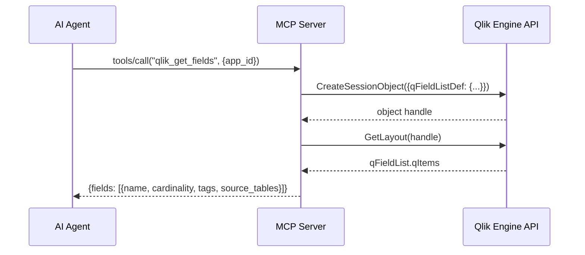
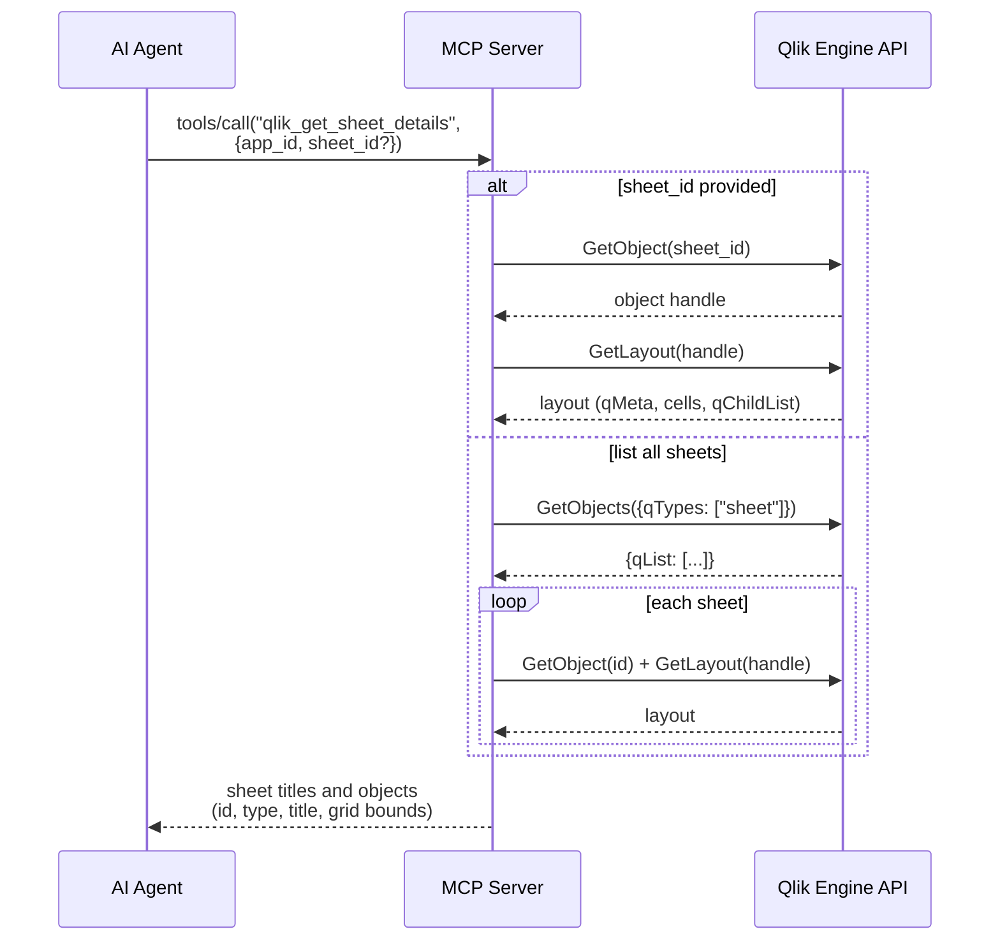
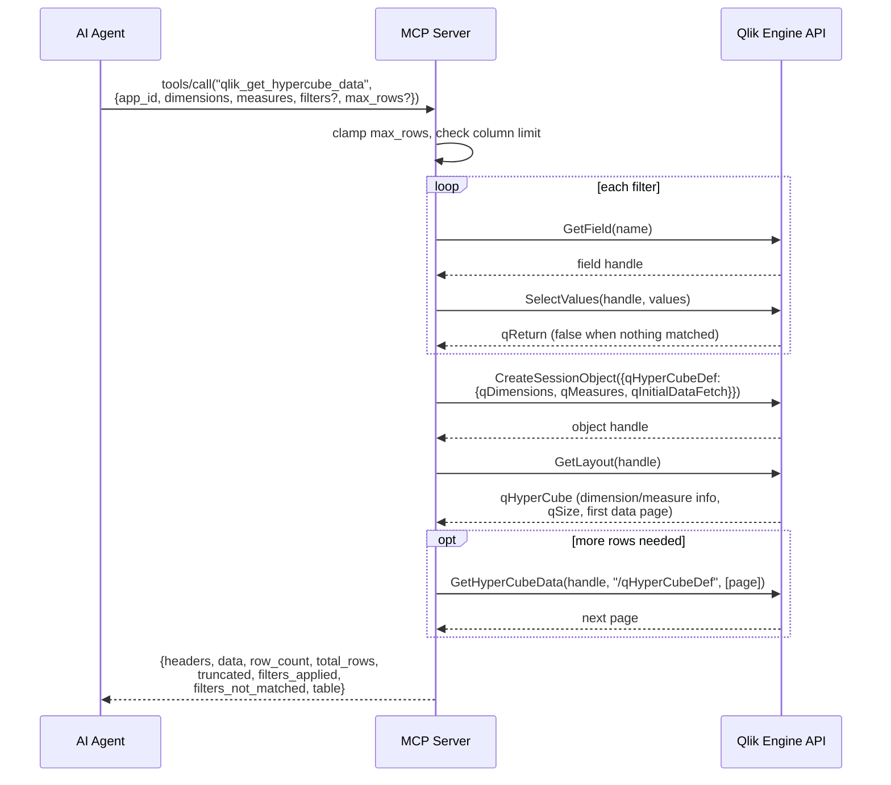
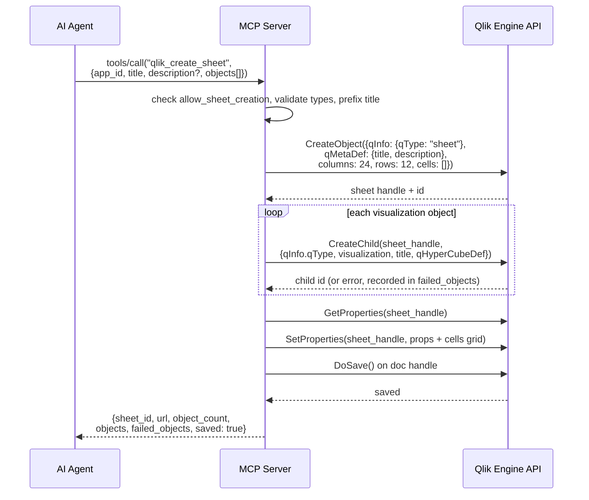

# C3: Component Diagram

Internal components and interaction sequences.

## Common engine session lifecycle

Every engine-backed tool follows the same envelope. It is shown once here and elided in the sequences below.

## Tool Interaction Sequences

### qlik_search

### qlik_get_fields

### qlik_get_sheet_details

### qlik_get_hypercube_data

### qlik_create_sheet

