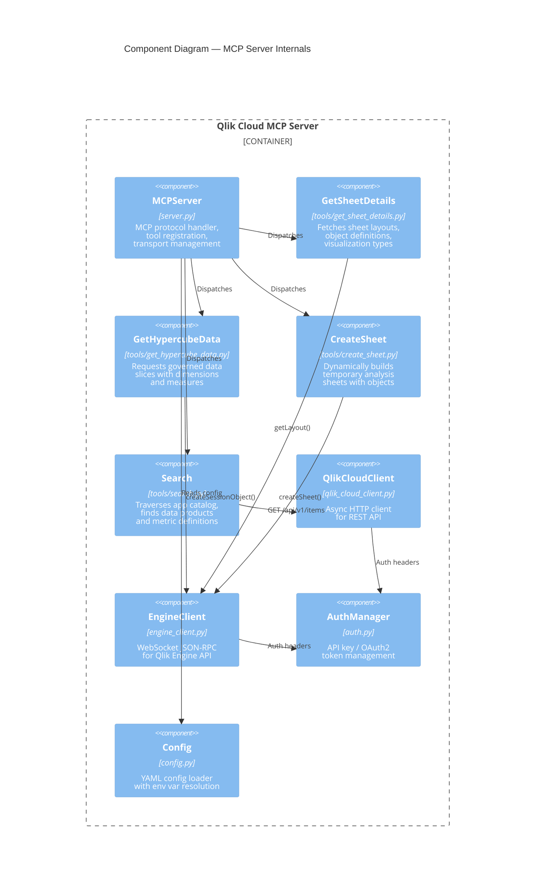
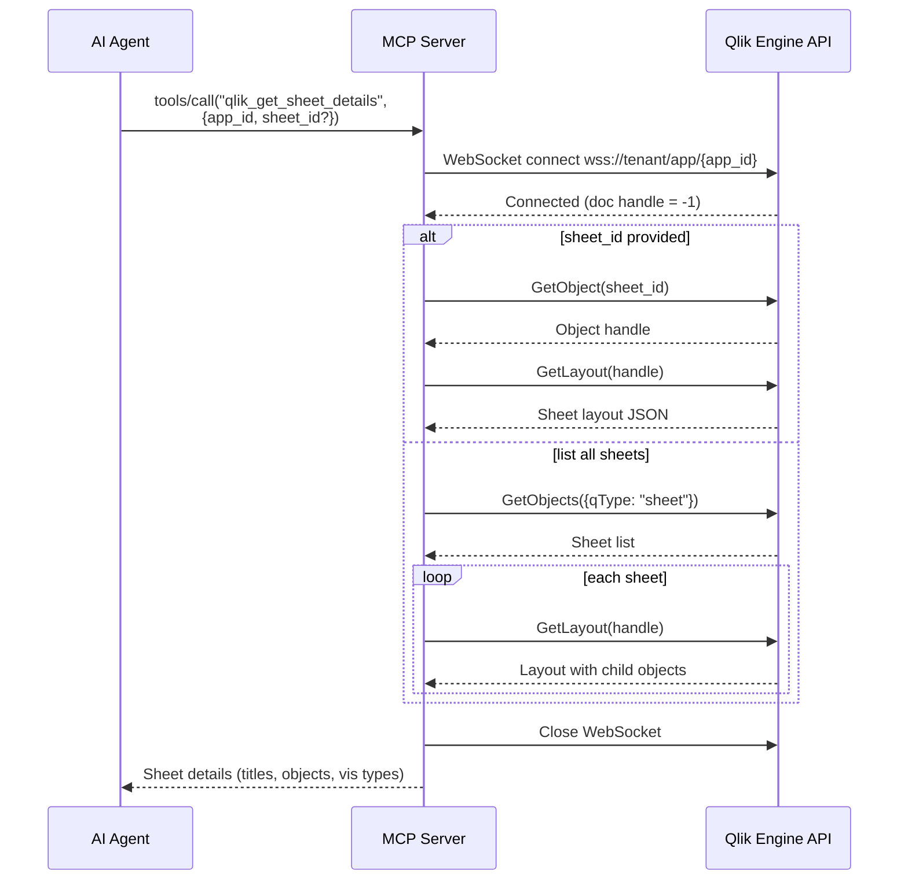
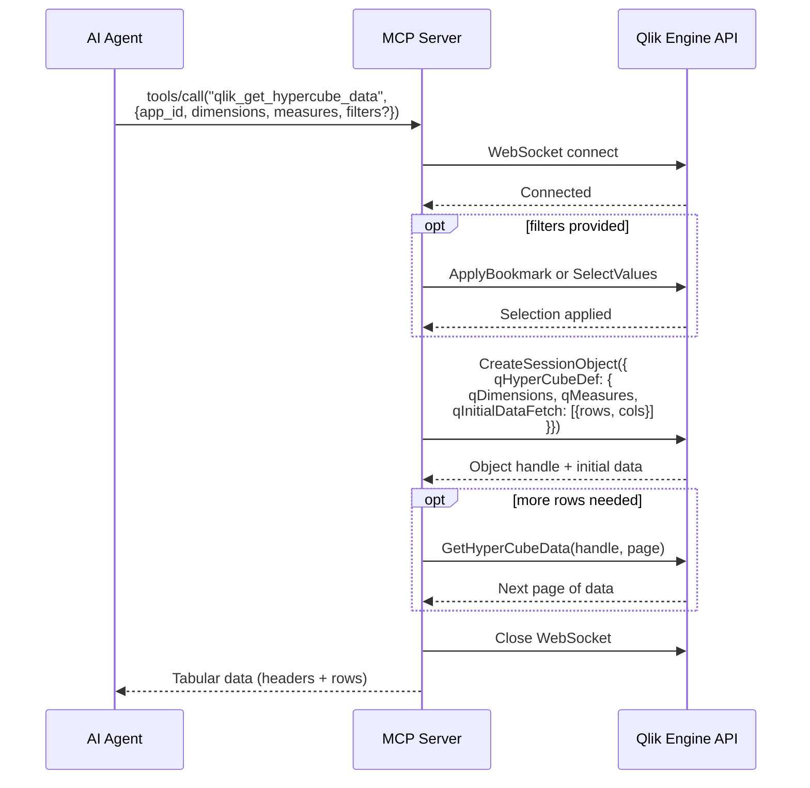
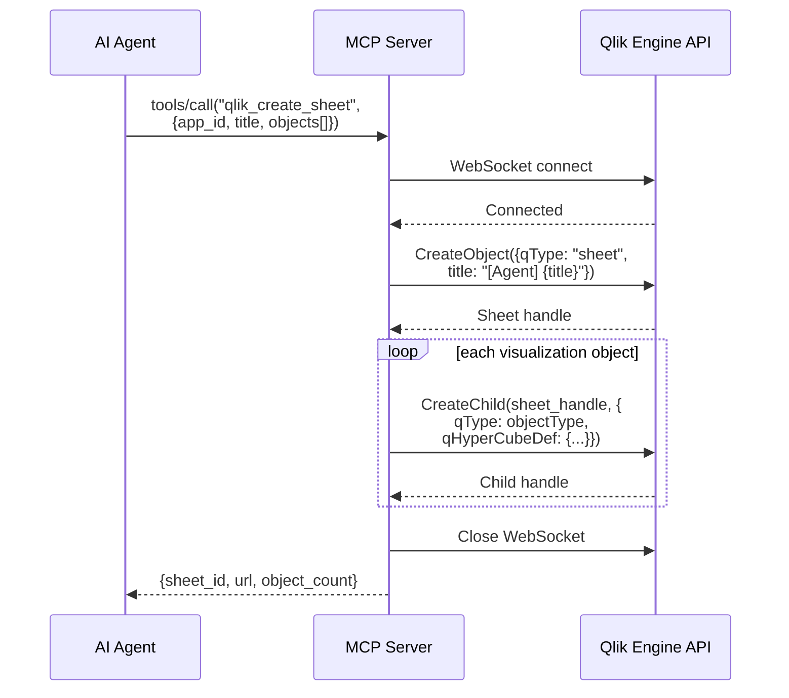
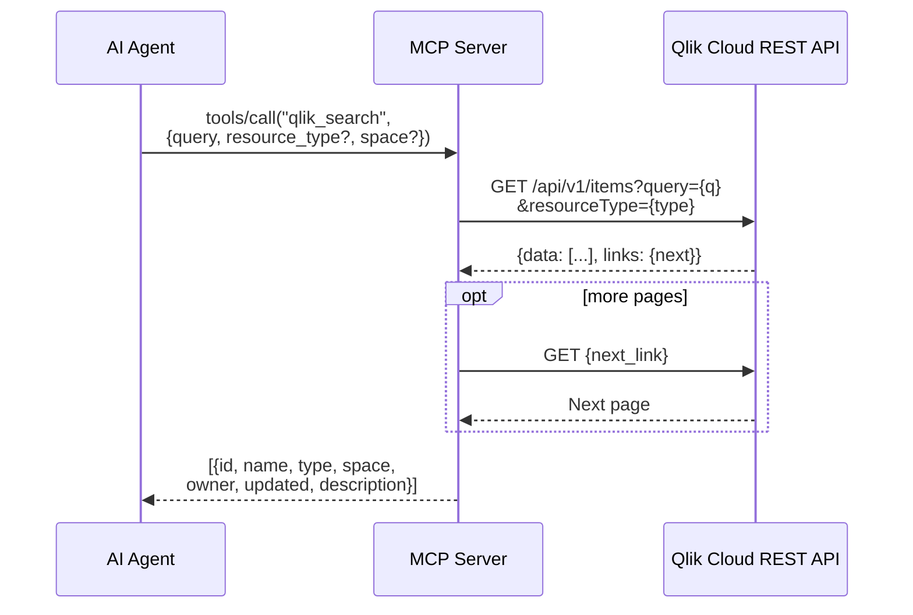

# C3: Component Diagram

Internal components and interaction sequences.

## Tool Interaction Sequences

### qlik_get_sheet_details

### qlik_get_hypercube_data

### qlik_create_sheet

### qlik_search

