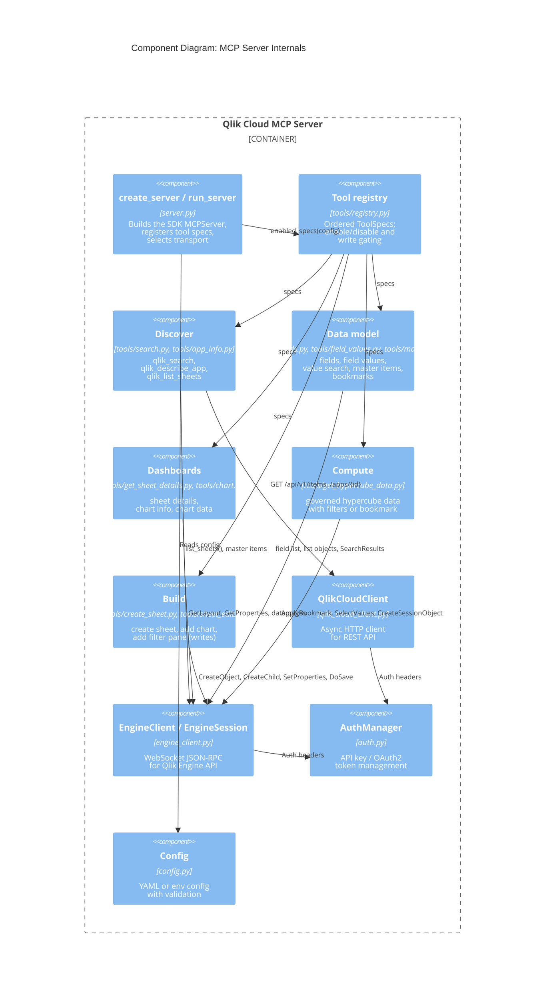
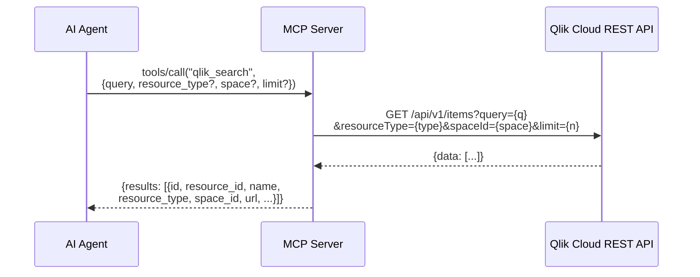
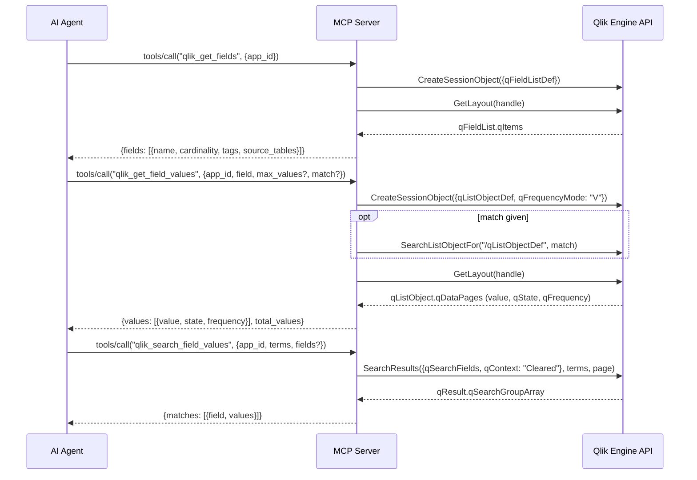
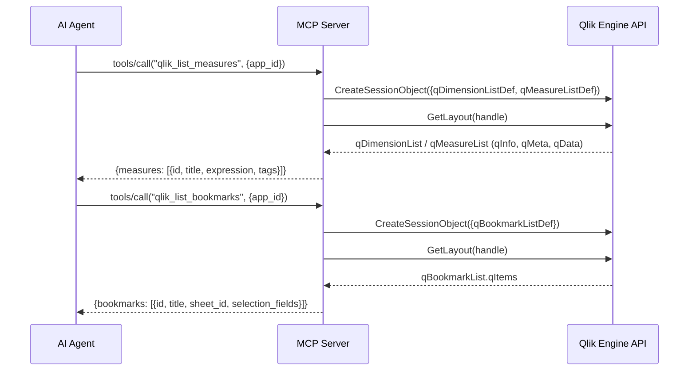
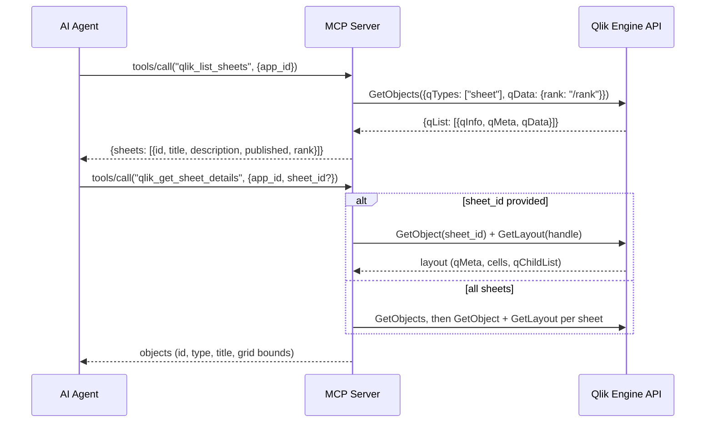
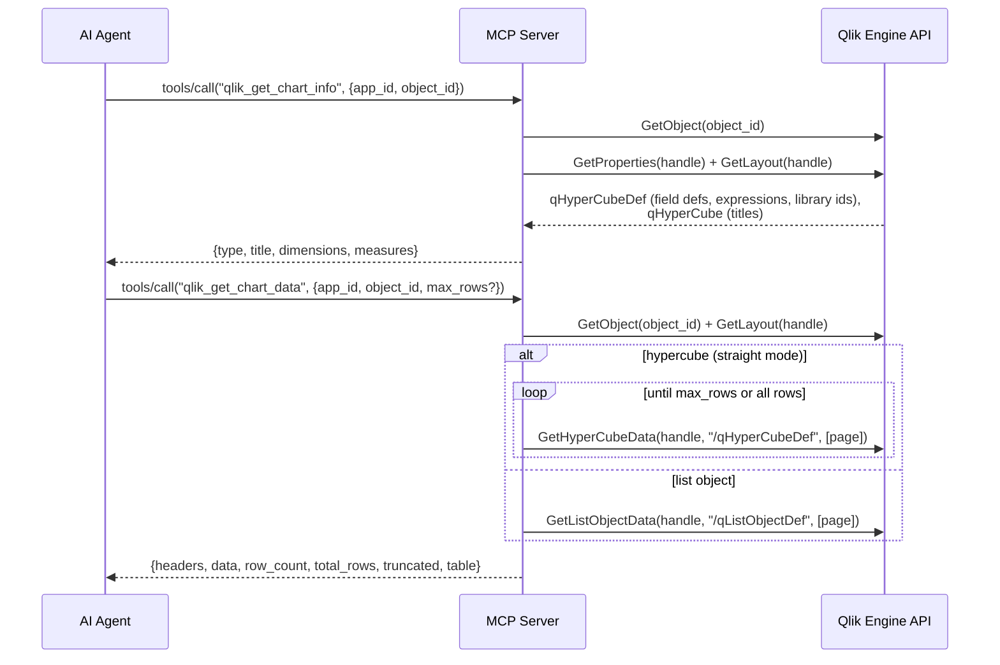
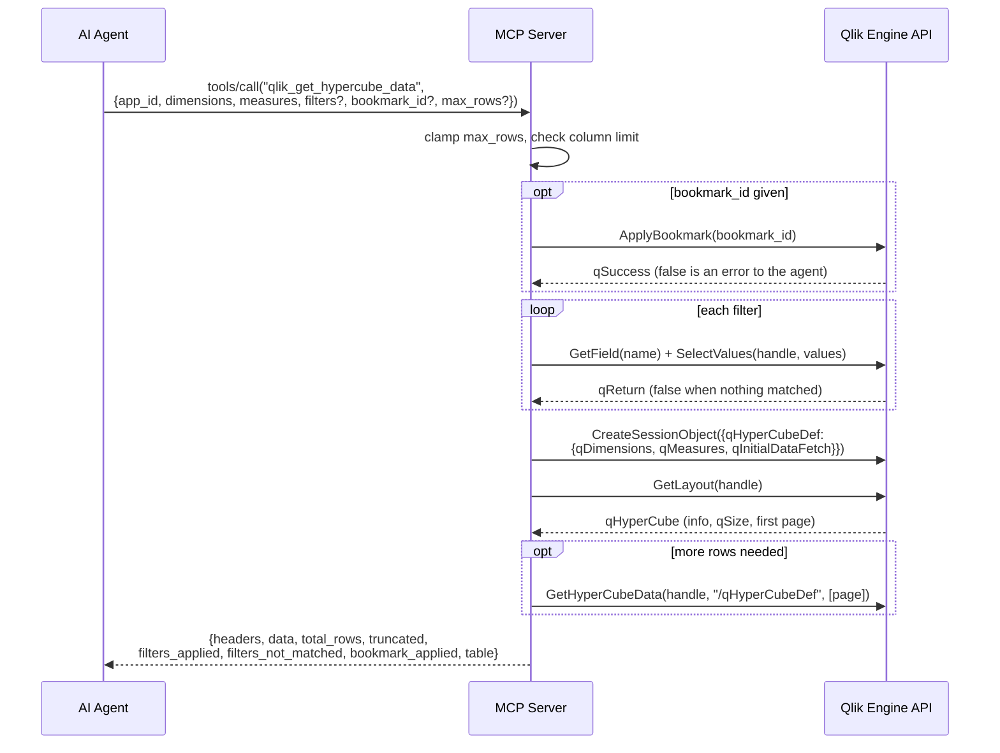
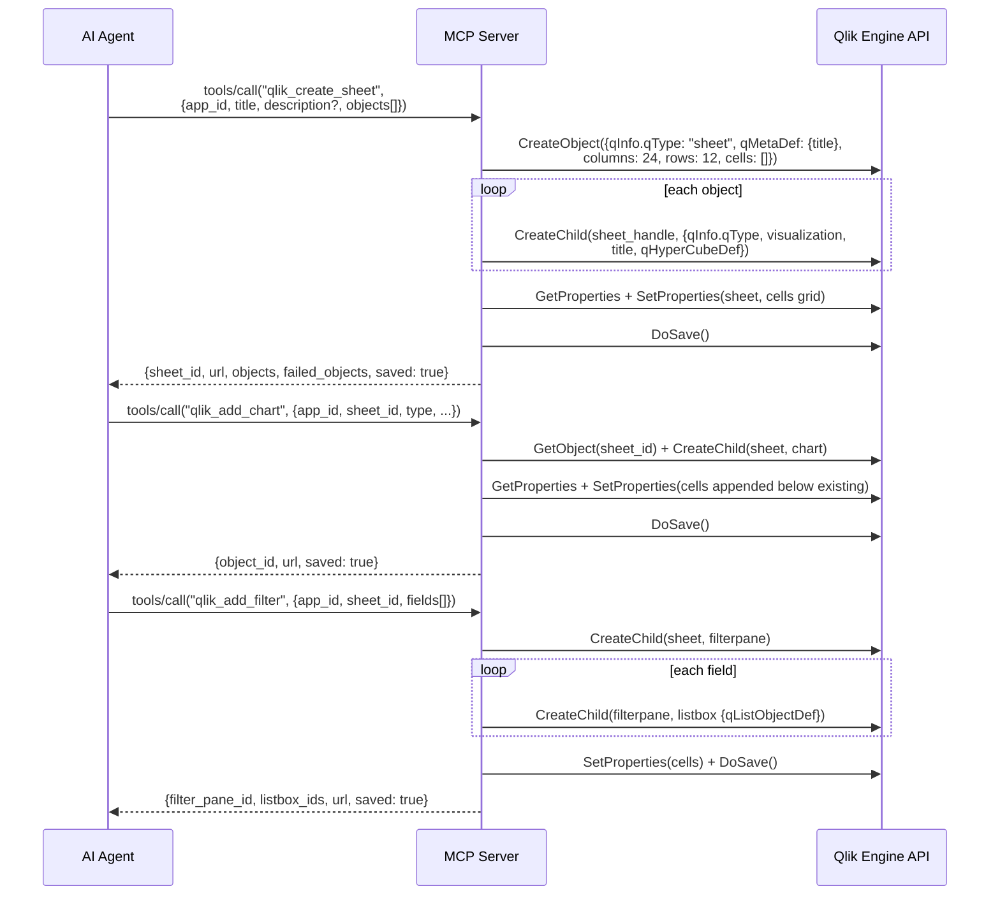

# C3: Component Diagram

Internal components and interaction sequences.



## Common engine session lifecycle

Every engine-backed tool follows the same envelope. It is shown once here and elided in the sequences below.

```mermaid
sequenceDiagram
    participant Tool as Tool handler
    participant Engine as Qlik Engine API

    Tool->>Tool: validate app_id is a UUID
    Tool->>Engine: WebSocket connect wss://tenant/app/{app_id}<br/>Authorization: Bearer ...
    Tool->>Engine: OpenDoc(app_id) on handle -1
    Engine-->>Tool: {qReturn: {qHandle: doc}}
    Note over Tool,Engine: tool-specific calls; results are unwrapped<br/>(qLayout, qDataPages, qResult, qList, qProp)
    Tool->>Engine: Close WebSocket
```

## Tool Interaction Sequences

### qlik_search



### qlik_describe_app

```mermaid
sequenceDiagram
    participant Agent as AI Agent
    participant MCP as MCP Server
    participant REST as Qlik Cloud REST API
    participant Engine as Qlik Engine API

    Agent->>MCP: tools/call("qlik_describe_app", {app_id})
    MCP->>REST: GET /api/v1/apps/{app_id}
    REST-->>MCP: attributes (name, owner, reload time, section access)
    MCP->>REST: GET /api/v1/apps/{app_id}/data/metadata
    REST-->>MCP: tables, fields (optional; skipped on error)
    MCP->>Engine: GetObjects(sheets), master item lists, bookmark list
    Engine-->>MCP: counts
    MCP-->>Agent: overview with tables and counts
```

### qlik_get_fields, qlik_get_field_values, qlik_search_field_values



### qlik_list_dimensions, qlik_list_measures, qlik_list_bookmarks



### qlik_list_sheets and qlik_get_sheet_details



### qlik_get_chart_info and qlik_get_chart_data



### qlik_get_hypercube_data



### qlik_create_sheet, qlik_add_chart, qlik_add_filter


