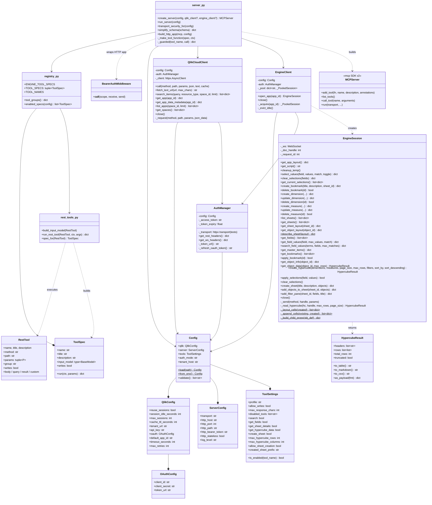

# C4: Code Diagram

Class-level detail showing key relationships.



## Key Design Patterns

### Connection-per-Call (Engine API)
Each tool invocation opens a fresh WebSocket connection, performs the operation, and closes. This keeps the MCP server stateless and avoids session management complexity.

```python
async def handle_get_hypercube_data(engine, params, max_rows_limit=10000, max_columns_limit=50):
    input_data = GetHypercubeDataInput(**params)
    async with engine.open_app(input_data.app_id) as session:
        for f in input_data.filters or []:
            await session.apply_selections(f.field, f.values)
        result = await session.create_hypercube(
            dimensions=input_data.dimensions,
            measures=input_data.measures,
            max_rows=min(input_data.max_rows or 1000, max_rows_limit),
        )
    return {"headers": result.headers, "data": result.rows, ...}
```

### Async Context Manager for Engine Sessions
`EngineClient.open_app()` is an `asynccontextmanager`: it validates the app id, connects, calls `OpenDoc`, yields an `EngineSession`, and always closes the socket, even on errors.

### Handlers take dicts, the SDK sees flat signatures
Each tool module exposes a `handle_*` coroutine that accepts a plain dict and returns a plain dict, plus a `ToolSpec` naming the tool, its description, its Pydantic input model, and whether it writes. `tools/registry.py` orders the specs. For each enabled spec, `server.py` builds a wrapper function whose `__signature__` is generated from the model's fields (types, descriptions, constraints, defaults) and registers it with `MCPServer.add_tool()`. The SDK derives the JSON Schema from that signature, so the Pydantic model is the single source of truth and adding a tool means adding one spec.

### Declarative REST tools
`RestTool` records (method, path template, `P` parameters with a location of path, query, body, or local, and an optional result shaper or custom coroutine) describe most platform tools. `build_input_model` turns the parameters into a Pydantic model with `create_model`, so the same signature and schema machinery serves engine and REST tools alike; `run_rest_tool` fills the path (rejecting unexpected characters), camel-cases query and body names, skips absent and false parameters, and maps HTTP errors to hints.

### Session pool
`EngineClient` keeps a `_PooledSession` per app with its own lock. `open_app` acquires the lock, reconnects if the session expired or broke, yields the `EngineSession`, then destroys temporary objects and alternate states before releasing. Idle and overflow sessions are closed as calls complete.

### Raw engine results are wrapped
The JSON-RPC engine returns `{"qLayout": ...}`, `{"qDataPages": [...]}`, `{"qResult": ...}`, `{"qList": [...]}`, and `{"qProp": ...}`. `EngineSession._unwrap` strips the wrapper while tolerating already-flat values, and the test fakes answer in the wrapped form so the tests exercise the real path.

### Pydantic Input Validation
Tool inputs are validated twice: by the SDK against the generated schema, and again by the Pydantic model inside the handler (which also runs custom validators such as the allowed resource types). Validation failures become `{"error": "Invalid input: ..."}` payloads.

### Error Sanitization
`_guarded()` in `server.py` maps failures to agent-readable payloads. Engine and REST errors keep their message (bounded to 500 characters). Authentication and unexpected errors are logged in full but reported generically so credentials and stack details never reach the model.

### MCP SDK Integration
The `mcp` SDK handles protocol serialization, transport negotiation, structured output, and schema exposure. The server only implements the tool functions and picks the transport in `run_server()`.
