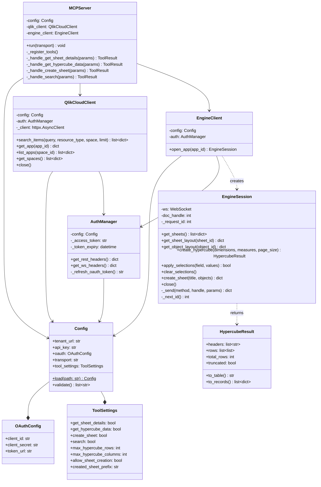

# C4: Code Diagram

Class-level detail showing key relationships.



## Key Design Patterns

### Connection-per-Call (Engine API)
Each tool invocation opens a fresh WebSocket connection, performs the operation, and closes. This keeps the MCP server stateless and avoids session management complexity.

```python
async def _handle_get_hypercube_data(self, params):
    async with self.engine_client.open_app(params["app_id"]) as session:
        result = await session.create_hypercube(
            dimensions=params["dimensions"],
            measures=params["measures"],
        )
    return result.to_records()
```

### Async Context Manager for Engine Sessions
`EngineSession` implements `__aenter__`/`__aexit__` to ensure WebSocket connections are always properly closed, even on errors.

### Pydantic Input Validation
Tool input parameters are validated using Pydantic models before being passed to handlers, providing clear error messages when agents send malformed requests.

### MCP SDK Integration
The `mcp` SDK handles protocol serialization, transport negotiation, and tool schema exposure. The server only implements the tool handler functions.
